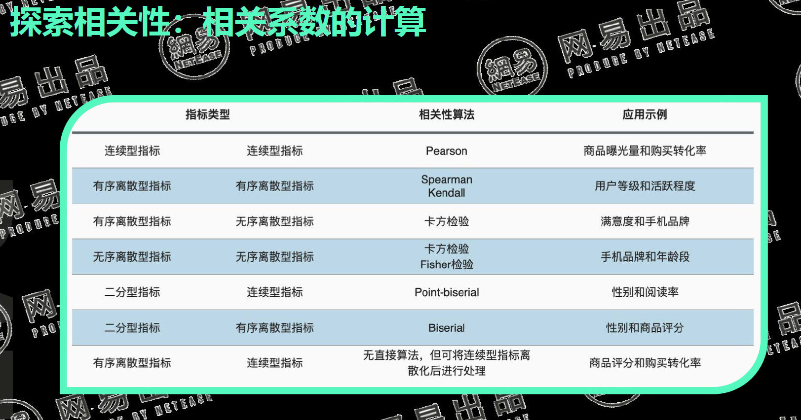

# 1 统计学及描述性统计
- 统计学的两个分支：描述性统计和推断性统计
- 描述性统计——集中趋势
  - 平均数
    > 衡量数据中心位置，容易受异常值影响，因此求平均数之前需要先处理异常值
  - 中位数/四分位数
     > 排序后处于正中间的数据就是中位数。不容易受极端值影响
  - 众数
     > 一组数中出现最多的数，不容易受到极端值影响
- 描述性统计——波动趋势
  - 方差（标准差）
      > 定义为一组数据与其均值为代表的中心平均离散水平。受极端值影响，且必须服从正态分布，否则需要转换。
  - 离差
    > 最大值与最小值的差值 ，不常用，易受极端值影响
  - Z分值
    > z分数用于衡量数据项在数据集中的 相对位置 ，用人类语言来说，它描述的是数据项距离均值有几个标准差。

# 2 数据的度量、频数和概率
- 数据的类型和度量
  

- 频数和概率和累计频数
  - 频数：数据出现的频次
  - 频率：数据出现的概率，且概率总和等于1
  - 累计频数：累计频数只有在数据有明确分类的时候才有意义，就是说对于定序、定居、定比的数据才有意义

# 3 概率分布
- 概率的类型
  - 理论概率 假设所有结果发生的可能性一致，用一种事件发生的次数除以所有可能结果的总数。如掷骰子

  - 频率概率 依据观察数据或者实验数据，就是某一事件的相关频率。如试验频次统计或互联网用户行为统计【基于经验，使用最多】

  - 主观概率 是依据经验或者主观估计的数值。如个人经验预估

- 常用的概率分布
  - 泊松分布
  - 二项分布
  - 正态分布

# 4 相关性分析
- 相关性的类型
  - 正相关：两个变量同时变大或者变小
  - 负相关：两个变量变化趋势相反
  - 不相关：两个变量没有明显关系
  - 非线性关系：两个变量有关系，但是散点图呈现出来的规律不是线性

- **探索相关性**：相关系数的计算
  - Pearson相关系数：
  - spearman相关系数：
  - Kendall系数
  - 卡方检验
  - fisher检验

- **解释相关性**
  - 发现异常值并处理
  - 注意不恰当的分组
  - 相关并不蕴含因果关系
  - 寻找业务相关性相关的解释

# 5 描述性统计分析报表和可视化
- 条形图——用的比较多 
- 堆积条形图
- 百分比堆积条形图
- 折线图
- 瀑布图
- 箱线图
- 散点图
