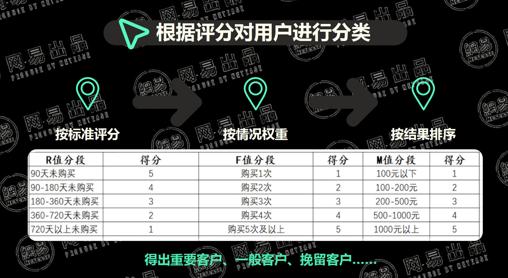

# 1 8大数据分析思维

- 分类思维
- 对比思维
- 时间序列思维/趋势分析
- 漏斗思维/流程思维
- 逻辑树思维
- 指数化思维
- 下钻思维
- 经营思维

## 1.1 分类思维
    
当进入一个新的领域或者面临一大堆不清楚的概念，可以用分类的方法将其总结归纳，简单明了。

分类原则：MECE 
- Musually
- Exclusive 
- Collectively
- Exhaustive
不重叠、不遗漏、相互独立、包含所有
> 案例：管理学分类、垃圾分类、超市分类、图书馆分类、行业分类、人群画像及推荐算法
> 常见方法：二分法、三分法（RFM模型）

所以怎么将分类思维用在数据分析中呢？
当眼前的数据集过于庞大且杂乱无章，这时候可以先将其分类归纳，使用MECE原则做到分类相互独立，包含全部。
之后可以使用对比思维发现各项子集间的差异，使用趋势分析思维发现数据的规律。
## 1.2 对比思维
对比看哪些点？
- 相似性
- 数据变化特点
- 数据发展趋势（趋势分析）
- 优化差异方法

怎么对比？
- 横向对比
    - 同比分析 跟指标每年同一时间作对比可以消除季节性等波动性因素
    - 环比分析 跟前一周期对比，寻找周期性变化的规律

- 纵向对比 比较同类或者相似的维度，发现潜在规律
## 1.3 时间序列思维/趋势分析
> 从时间上来看，洞察事物变化的规律

那看哪些趋势呢？
- 整体变化趋势，如人口、经济、行业
- 季节性/局部变化趋势，段时间内的波动规律，如降雨量、温度等
- 周期性趋势/局部
## 1.4 漏斗思维/流程思维
按照任务的完成路径，识别关键的行为转化点，分析节点间的转化与流失情况

常见漏斗有哪些？
- 用户增长漏洞AARRR
- 招聘漏斗 邀约-到访-面试- offer发放-入职
- 客户转化漏斗 广告展现-点击-访问-咨询-承接
## 1.5 逻辑树思维
> 逻辑树思维用来拆分问题，只有把拆分的问题都解决了，那个总的问题就解决了。
- 问题陈述
    - 问题一
        - 分支问题1
        - 分支问题2
    - 问题二
        - 分支问题1
        - 分支问题2
    - 问题三
        - 分支问题1
        - 分支问题2
## 1.6 指数化思维
> 将衡量一个问题的指标分别量化，组成一个综合指数（降维）

跟下钻思维相反
**指数思维：化繁为简**
**下钻思维：由浅入深**

## 1.7 下钻思维
> 将核心指标逐步向下1-3级分解得到新的指标的分析方法
## 1.8 经营思维
> 指数据分析从业人员要讲数据分析的关键落脚点放到业务上如何通过数据分析提升企业的盈利能力

经营思维常用模型：财务模型finacial Model 、UE模型、BreakEven模型等

核心要点：
- 帮助企业提高盈利能力
- 提升用户体验和满意度
- 具有持续的竞争力

# 2 5大数据分析模型
- 用户增长
    - AARRR
    - 增长黑客
    - 增长引擎
- 用户运营
    - 用户画像
    - 用户分层
    - 用户生命周期
    - ROI
- 用户体验
    - 用户旅程
    - GSM模型
    - Heart模型
    - Pluse模型

## 2.1 AARRR模型【重要】
- 用户获取（怎么做？）
    - 广告语 打动人心的广告
    - 获客渠道 病毒口碑渠道 、 有机渠道 、 付费渠道
    - 病毒营销 让分享邀请成为用户体验的有机组成部分以实现指数裂变式增长
- 激活（怎么做？）
    - 核心：让用户体验到爽的感觉 
    - 创建体验路线图，关注每个节点的转化率和流失率
- 留存（怎么做？）
    - 初期：优化用户体验
    - 中期：让用户养成使用产品的习惯
    - 后期：升级现有功能或者推出全新功能
- 变现（怎么做？）
    - 提高每位用户带来的收益：认识用户-了解用户需求-定制产品功能-优化定价-增长变现
- 自传播推荐（怎么做？）
    - 社交网络推广
    - 我觉得提高产品自传播效率，关键在于打造好的产品，可以解决用户痛点，具有良好的用户体验，那么自传播效率肯定非常高

案例：拼多多的AARRR模型
- 获取用户
    - 广告 （线上广告、媒体广告、户外广告
    - 裂变 （好友砍价、红包助力体现
- 激活
    - 1 元购、新人首单全额返、新人专享优惠
- 留存
    - 缩短购买链路，减少用户决策成本、小游戏
- 变现
    - 个性化产品推荐、拼单返现、百亿补贴
- 自传播
    - 好友砍价、红包助力提现、
    - 7 日拼红包

## 2.2 RFM模型【非常重要】
>  衡量用户当前价值和客户潜在价值的重要工具和手段
- R Recency最近一次消费
  - 影响最近消费的因素有哪些？
    - 店铺记忆强度——决定接触策略
    - 接触机会多少——决定接触频次
    - 回购周期——可以决定刺激力度
- F Frequency消费频率
  - 影响消费频次的因素？
    - 品牌忠诚度——决定资源投入
    - 店铺熟悉度——决定营销优先级
    - 客户会员等级——决定活动方案
    - 购买习惯
- M Monetary消费金额
  - 影响消费金额的因素？
    - 消费能力——根据消费能力推荐商品
    - 产品认可度——决定折扣门槛、活动方案

### RFM模型使用方法
- 根据定义对客户分类——运营常用方法
  > 根据RFM三个维度再细分为H高活跃、高频次、高消费用户，L低活跃、低频次、低消费用户总共8个维度
  
- 根据评分对用户进行分类——DA/BI常用方法
  
- RFM+聚类模型进行分类【非常重要】
  - 数据获取：SQL 来自内部消费用户、标签相关数据
  - 数据清洗分析：剔除异常值、重复值、缺失值
  - RFM建模：定义用户消费行为；定义R、F、M；建模
  - 特征分析：相关性分析，降维分析
  - 聚类：聚类算法进行机器学习

## 2.3 CLV用户生命周期模型
> 指用户在其生命周期内所能带来的商业价值(从安装到卸载)
首次接触产品-下载-APP 注册-绑卡-交易-流失

- C Customer用户
- L Lifetime生命周期
- V Value价值

### CLV模型计算方法
- 历史CLV
  - CLV = 所有成交量 x AGM平均毛利率
- 预测CLV
  - CLV = （总NPV） - 成本
    > NPV 来自客户所有未来收益之和 净现值

### CLV用户生命周期模型的应用
以用户生命周期价值CLV 和 ROI 驱动的用户干预视角， 提升运营效率
- 确定用户分类
  > 使用RFM模型将用户分为8类，以半年为一周期，标出各周期的下单用户， 将用户划分为R1~R8 共8类
- 计算用户CLV
  - 计算8类用户的半年CLV，确定CLV的衡量方法，如用户周期内净收入，计算各个周期内各个用户的CLV
- 衡量用户变迁收益
  - 计算用户变迁后的ΔCLV和转化率
  - 计算64个用户变迁路径对应的ΔCLV
  - 计算64个用户变迁路径对应的转化率
- 衡量干预收益成本
  - 计算干预变迁路径的收益和成本
  - 干预收益：干预后转化的概率 △𝐶𝐿𝑉

- 计算干预变迁路径的收益和成本
    - 干预成本：
    - 干预直接成本：直接投入干预的资源
    
    - 干预间接成本：不干预净收益 即不干预转化的概率 △𝐶𝐿𝑉
- 确定干预优先级
  - 计算各路径的 ROI 确认优先路径
  - 计算各变迁路径的 ROI 即干预收益 干预成本
  - 根据资源约束和各路径的 ROI 排序 寻找最优路径集
### CLV用户生命周期模型的应用
如何用CLV来衡量投资效率
- 衡量用户变迁收益
  
- 衡量干预收益成本
  
- 确定干预优先级
  

## 2.4 事件分析模型&用户旅程模型
- 事件分析模型的定义
  > 研究某行为事件的发生对企业组织价值的影响以及影响程度
  一般分为追踪过程和挖掘原因两个部分。
  应用场景有电商领域的营销时间、日常波动分析、数据异常原因分析

- 事件分析模型的步骤
  - 定义时间
    - Who When Where What How 
  - 多维度下钻分析
    - 支持下钻分析、条件筛选
    - 精细化查看事件数据
    - 配置追踪事件属性
  - 解释与结论
    - 解释结果
    - 判断是否符合预期
    - 不足之处再分析和实证

## 2.5 用户旅程模型
> 定义为用户在APP或网站的访问路径，以衡量优化营销效果，或者了解用户行为偏好
这里可以利用漏斗思维分析用户的流失率

具体体现：用户旅程地图，一般是UE做这个事情。

# 3 六大数据分析战略模型
## 3.1 BCG矩阵【重要】
### 3.1.1 如何绘制BCG矩阵？
- 横轴是相对市场占有率从低到高排布
  > 相对市场占有率 = 本公司某业务某期销售额 / 最强竞争对手该业务本期销售额
- 纵轴是市场增产率从低到高排布
  > 市场增长率 = （本期总销售 - 上期总销售）/ 上期总销售 

- 中间面积代表此业务在所有业务中的相对低位和贡献
### 3.1.2 不同象限产品的特定发展前景和战略选择？
- **明星类产品** 发展前景好竞争力强需加大投资支持力度
- **问题类产品** 发展前景好但市场开拓不足，需谨慎投资
- **现金牛产品** 应该降低投资维持市场占有率延缓衰退
- **瘦狗类产品** 利润率低甚至亏损需要采取撤退战略
### 3.1.3 波士顿矩阵的决策应用
- 确定资金的移动路线和产品发展路线
- 对业务组合合理性判断——成功的产品走势应该是月牙环状
> BCG矩阵有什么作用？
- 将不同业务综合到一个矩阵中比较，简单明了
- 表明每个经营单位当前竞争地位，更加清楚了解它们作用，便于分配投入资源

## 3.2 PESTLE分析
> 从行业发展的宏观要素进行分析，比如：
- 政治
- 经济
  - 经济周期
  - 国民收入变化趋势
  - 利率
  - 货币供应
  - 通货膨胀
  - 失业
  - 可支配收入
- 社会
  - 收入分布
  - 社会流动性
  - 生活方式变迁
- 技术
- 法律
- 环境

## 3.3 SWOT分析 
> 从优势、劣势、机会威胁四个角度分析

## 3.4 价值链模型【重要】
> 一整条产业链路，包含所有节点。原材料采购——供应商——制造商——分销商——零售商——消费者

行业价值链>公司价值链>运营价值链
- 供应商
- 制造商
  - 研发
  - 采购
  - 制造/运行
    - 材料预备
    - 功能转变
    - 组装成行
    - 品质保证
    - 包装
  - 营销及销售
  - 分销/分销物流
  - 售后
- 流通（经销/零售）
- 消费者

> 思考：价值链模型有助于梳理对整个行业结构的认知，往下可以下钻至公司价值链，摸清楚组成一个公司的基本结构，还可以再往下进行梳理。这样一来公司在行业内处于什么地位就一目了然了。
> 可以运用MECE原则、流程思维来梳理价值链。
> 可以结合BCG矩阵调整公司投入的侧重点！

## 3.5 生命周期模型
> 以历史和发展的眼界，审视整个行业的生命周期

> 企业在不同阶段的发展策略应该是不同的
- 初创期
  - 市场需求小、收入低、风险大规模小、适合风投
- 成长期
  - 市场需求扩大风险大、收入增长、投资需求很强烈（建议投资）
- 成熟期
  - 生产能力饱和、、市场也接近饱和增速下降、垄断、风险小、、投资需求不大（适合投资）
- 衰老期
  - 出现大量替代品、市场需求减少、收入下降、风险增加、（不适合投资）

## 3.6 行业集中度模型
> 行业集中度反应一个行业整合程度

- 散点市场
- 块状同质化市场
- 团装异质化市场

#  4 认识数据分析
## 4.1.1 什么是商业数据分析？
  > 纽约大学（New York University）曾对商业数据分析专业做过这样的定位：
  > 这是一门研究数据，以商业理论为基础，从数据分析出发，依靠统计工具，以决策优化为目的，洞察数据背后的规律，为商业创造最大价值
## 4.1.2 商业数据分析需要具备的能力
- Business Analysis
  > Business Analysis是以案例分析为主，数据分析为辅的传统商科，大多开设在商学
  院下，作为MBA的一个分支方向，主要是针对公司整个运营流程、业务发展方向的分析
- Data Analysis
  > Data Analysis和BA最为接近，需要掌握基础的SQL数据提取、Excel/Python数据分
  析即可。区别在于，BA作为manager和analyst之间的桥梁，更需要有一定的沟通能
力和商业嗅觉
- Data Science
  > Data Science 以高级建模为主，针对复杂的问题来设计技术解决方案。经常开设在
  计算机学院或工程学院下，一般会涉及较深入的计算机编程、统计模型，对技术要
  求相对较高
- Management Information System
  > MIS和BA有本质的区别，MIS关注的是整个计算机系统的架构，例如企业数据库的
  建立和维护，是利用计算机的基础设施和硬件来处理数据，而BA关注的是如何分析
  数据
## 4.1.3 商业分析师的市场需求
- 整体需求规模
    1000W~2000W  
- 数据科学家
  > 主要是predictive analysis，工作内容以高级建模为主，会针对复杂的问题来设计技术方案， 编程能力的强弱将会成为重要分水岭。
- 经营管理分析
  > 利用数据分析报告辅助决策支持，
评估历史战略市场表现，制定新的营收及定价策略，与商业团队进行跨职能协作，优化营收管理流程

> 不同岗位对应不同的能力，但归根结底，分析要落地业务才有意义
## 4.2 商业数据分析业务流程
### 4.2.1 商业数据分析的三个阶段六个步骤
#### 阶段一：构建问题
- 识别问题——怎么识别问题？核心问题：问题是什么以及这个问题为什么重要？
- 总结发现——怎么总结问题？核心问题：以前是怎么定义和解决这些问题的？
> SCQ 表达法
Situation情景
Complication矛盾
Question问题

#### 阶段二：分析和解决问题
4步分析和解决问题
- 明确问题核心 
  1. 优先考虑工作需求
  2. 契合编程语言技能
  3. 善用 SCQ 思维导图
  4. 巧用关键少数法则
   
- 围绕假设分析 
  1. 以认证假设为目标
  2. 筛选最契合的分析
  3. 灵活应对数据局限
- 制定方案执行 
  1. 依据目标出发
  2. 了解执行责任
  3. 初步模拟输出
  4. 契合编程语言
- 问题深入解读
    1. 锻炼良好品质 毅力 创意 智慧
    2. 剖析问题 不局限于常规分析

- 建模 —— 模型是某个现象或问题的一种有目的性的简化呈现
- 收集数据 —— 一手数据、二手数据、结构化数据、非结构化的数据、内部数据、外部数据 
- **分析数据 —— 基本方法**：`对比分析`、`构成分析`、`趋势分析`、`描述型分析`、`预测性分析`、`相关性分析`
#### 阶段三：传达结果并行动
- 描述问题及其背后的故事、模式、数据的使用以及分析变量之间的关系（可视化）

- 三种传达结果的方式
  - 归纳推理
  - 演绎推理
  - 整体推理

## 4.3 商业数据分析师成长之路
### 4.3.1 企业内部的数据流转流程及分工
- 数据获取
    - 内部：通过数据埋点获取用户行为 、 交易行为等各类型的数据
    - 外部：通过网络爬虫获取外部相关的数据
- 数据存储
    - 通过数据仓库进行数据的存储一般会分为 ODS 、DWS DWD 、ADS 、 DIM 等数据存储方式
- 数据挖掘
  - 一般会有专门的数据挖掘部门通过**算法挖掘数据指标的内部联系**大数据分析 、 BI或算法部门负责完成机器学习的算法实践
- 数据报表
  - BI 根据数仓的底表，结合业务运营的需要建立`指标体系`并搭建
- 数据可视化
  - BI、商业分析 、业务运营会根据常指标进行运营或经营数据的分析 并将其可使化发现其中的机会点或问题点并改进
- 决策建议
  - 根据前述数据的分析的结果给出业务发展的建议或决策依据 一般由运营 、 BI 、 商业分析等部门来完成
### 3.2 商业数据分析师的职业选择
- 上游 数据类 如数据仓库、数据科学家、爬虫专家、数据治理专家
- 本职 商业数据分析师 商业数据分析专家
- 下游 策略类
  如商业分析
  战略分析、策略 运营专家
## 4 商业分析师技能模型
### 4.1  数据分析能力
  - 数据获取和数据处理  
  > 数据库：SQL、Hadoop、Hive、Python、SPSS、excel... 外部爬虫：Python

  - 分析建模 
  > Python 、 SPSS
  - 可视化 
  >  Excel 、 PPT 、tableau、PowerBI、Python
  - 分析方法论 
        - 对比分析
        - 构成分析
        - 趋势分析

### 4.2 逻辑思维能力
  - 结构化思维  
    - 金字塔结构:分类归纳，呈金字塔式结构化。
    - MECE原则：通过MECE 原则建立结构化的问题分析模型。
    - 结构化思维：
        - 象限法——BCG矩阵、RFM模型，
        - 流程法——漏斗分析、AARRR，
        - 公式法——公式拆解、归因分析、多维分析

  - 逻辑思维 
    > 对事物进行观察、 比较 、 分析 、 综合 、 抽象 、 概括 、 判断 、 推理的思维 逻辑思维基础方法是演绎和归纳
    - 逻辑树 将问题分为几个不同的枝干，层层拆解
    - 归纳法 时间顺序、结构顺序、重要性顺序
  
  - 战略思维 
    > 运用抽象思维所形成的若干个相关因素连续地 、 动态地 、 全面地度量这些相关因素的数量变化程度 并找出这些相关因素在数量变化程度上相互影响 、 共同变化的规律性
    - 终局思维 站在未来的角度，修正当前的做法
    - 产业思维 宏观影响、总体概况、竞争状况、驱动因素、发展趋势、启示
### 4.3 赢得结果能力
  - 拿结果能力 
    > 说服业务方或合作伙伴去做某项决策并能够有方法督促其实施 拿到业务结果的能力
  - 解决问题能力
    > 能够站在业务或运营的视角来看问题能够用业务的语言跟业务方沟通
  - 项目管理能力
    > 能够推动相关各方为达成目标而共同协作
  

# 5 指标体系搭建：业务分析框架
## 1.1 海盗指标说---AARRR 模型
- Acquisition获取用户
    > 相关指标：流量、 提及量 、 CPC Cost PerClick 每次点击费用 、 搜索结果 、 用户获取成本 、 点开率
- Activation提高活跃度
    > 注册人数、 注册量 、 新手教程完成量 、 至少用过一次产品的人数 、 订阅量
- Retention提高留存率
    > 用户参与度、 距上次登录的时间 、 日/月活、使用量 、 流失率
- Revenue获取营收 
    > 客户终生价值、 免费到付费 转化率 、 平均购物车大小 、 广告点入营收
- Referral自传播 
    > 注册人数、 注册量 、 新手教程完成量 、 至少用过一次产品的人数 、 订阅量

## 1.2 创业增长黑客
- 增长指标
- 聚焦领域
  > 大局观：通过北极星指标增长模型 指标分解找到当下性价比最高的增长杠杆
- 产生想法
- 上线实验
- 应用结果
- 分析数据
    > 针对聚焦领域充分头脑风暴 迅速上线试验 学习迭代

## 1.3 精益画布模型
- 问题
  - 调查对象中具有该需求的人数
  - 知道自己该需求的人数
- 用户细分
  - 独特的搜过关键词
  - 特定源头导入精准渠道流量
- 独特卖点
  - 用户反馈得分
  - 第三方独立评分
  - 竞争分析
- 解决方案
  - 使用最小可行性产品人数
  - 流失率和用户参与度
  - 最常/不常使用功能
  - 愿意付费人数
- 渠道
  - 每个渠道可导人的
  - 销售线索及客户量
  - 病毒式传播系数
  - 和病毒传播周期
  - 净推介值、打开率
  - 利润率、点入率
  - 网页排名
  - 消息到达率
- 关键指标【重要】
  - 用户数、 
  - 活跃用户数 、 
  - 在线时长 、 
  - 访问频次
  - 用户留存率
  - 跳出率 、 
  - 付费率 、
  -  平均客单价
- 竞争壁垒
  - 最终用户价值
  - 延展性
  - 独特性
- 成本分析
  - 获取用户成本
  - 研发成本
  - 运营成本
  - 销售成本
  - 综合成本公摊
- 收入分析
  - 商品销售收入
  - 营收的来源分析
  - 广告收入
  - 会员付费
  - 通过直接售卖产品服务获得收入如：阿里云
  - 增值服务
  - 抽成或佣金

## 5.2 多维度搭建业务指标体系
### 5.2.1 搭建数据指标体系的目的
- 确定指标体系
    > 北极星指标应能够最为精准地抓住企业为客户创造的核心价值
- 快速定位问题
    > 回溯与下钻找到关键指标波动的原因
- 提高分析效率
    > 能够覆盖大部分数据分析需求，快速分析

### 5.2.2 搭建数据指标体系的步骤
- 明确目标（企业发展的不同阶段有不同的目标，所以指标体系式变动的）
  > 一般来说 业务发展初期 关注`用户规模`、 `新增用户数`等指标 中期 `关注交易额`或`留存复购` 后期 关注`收入`或交叉营销 ARPU
- 搭建模型
  - 北极星指标模型
  - RFM模型
  - 公式法分解 
  - 漏斗法转化 进行埋点
- 建立指标体系
  - 用户类
    > 平均同时在线人数（ ACU
        最高同时在线人数（ PCU
        活跃用户数（ AU
        留存率（次日、三日、周、月）
        每日新增用户数
        每日失效用户数
  - 付费类
    > 活跃付费用户（ APA
        付费率
        每位用户平均收入（ ARPU
  - 游戏类
    > 游戏道具消费数
        用户平均在线时间
        游戏用户等级分布
        游戏用户持有虚拟货币量
  - 推广类
    > 下载量（日、周、月）
        注册用户量（日、周、月）
        激活率（日、周、月）
- 数据采集
  - 4W1H 埋点 建表
- 数据呈现