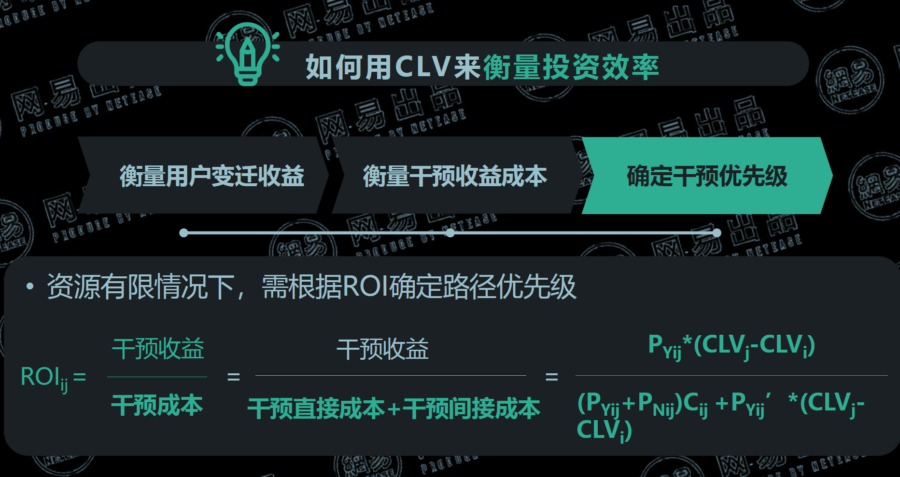

# 1 8大数据分析思维

- 分类思维
- 对比思维
- 时间序列思维/趋势分析
- 漏斗思维/流程思维
- 逻辑树思维
- 指数化思维
- 下钻思维
- 经营思维

## 1.1 分类思维
    
当进入一个新的领域或者面临一大堆不清楚的概念，可以用分类的方法将其总结归纳，简单明了。

分类原则：MECE 
- Musually
- Exclusive 
- Collectively
- Exhaustive
不重叠、不遗漏、相互独立、包含所有
> 案例：管理学分类、垃圾分类、超市分类、图书馆分类、行业分类、人群画像及推荐算法
> 常见方法：二分法、三分法（RFM模型）

所以怎么将分类思维用在数据分析中呢？
当眼前的数据集过于庞大且杂乱无章，这时候可以先将其分类归纳，使用MECE原则做到分类相互独立，包含全部。
之后可以使用对比思维发现各项子集间的差异，使用趋势分析思维发现数据的规律。
## 1.2 对比思维
对比看哪些点？
- 相似性
- 数据变化特点
- 数据发展趋势（趋势分析）
- 优化差异方法

怎么对比？
- 横向对比
    - 同比分析 跟指标每年同一时间作对比可以消除季节性等波动性因素
    - 环比分析 跟前一周期对比，寻找周期性变化的规律

- 纵向对比 比较同类或者相似的维度，发现潜在规律
## 1.3 时间序列思维/趋势分析
> 从时间上来看，洞察事物变化的规律

那看哪些趋势呢？
- 整体变化趋势，如人口、经济、行业
- 季节性/局部变化趋势，段时间内的波动规律，如降雨量、温度等
- 周期性趋势/局部
## 1.4 漏斗思维/流程思维
按照任务的完成路径，识别关键的行为转化点，分析节点间的转化与流失情况

常见漏斗有哪些？
- 用户增长漏洞AARRR
- 招聘漏斗 邀约-到访-面试- offer发放-入职
- 客户转化漏斗 广告展现-点击-访问-咨询-承接
## 1.5 逻辑树思维
> 逻辑树思维用来拆分问题，只有把拆分的问题都解决了，那个总的问题就解决了。
- 问题陈述
    - 问题一
        - 分支问题1
        - 分支问题2
    - 问题二
        - 分支问题1
        - 分支问题2
    - 问题三
        - 分支问题1
        - 分支问题2
## 1.6 指数化思维
> 将衡量一个问题的指标分别量化，组成一个综合指数（降维）

跟下钻思维相反
**指数思维：化繁为简**
**下钻思维：由浅入深**

## 1.7 下钻思维
> 将核心指标逐步向下1-3级分解得到新的指标的分析方法
## 1.8 经营思维
> 指数据分析从业人员要讲数据分析的关键落脚点放到业务上如何通过数据分析提升企业的盈利能力

经营思维常用模型：财务模型finacial Model 、UE模型、BreakEven模型等

核心要点：
- 帮助企业提高盈利能力
- 提升用户体验和满意度
- 具有持续的竞争力

# 2 5大数据分析模型
- 用户增长
    - AARRR
    - 增长黑客
    - 增长引擎
- 用户运营
    - 用户画像
    - 用户分层
    - 用户生命周期
    - ROI
- 用户体验
    - 用户旅程
    - GSM模型
    - Heart模型
    - Pluse模型

## 2.1 AARRR模型【重要】
- 用户获取（怎么做？）
    - 广告语 打动人心的广告
    - 获客渠道 病毒口碑渠道 、 有机渠道 、 付费渠道
    - 病毒营销 让分享邀请成为用户体验的有机组成部分以实现指数裂变式增长
- 激活（怎么做？）
    - 核心：让用户体验到爽的感觉 
    - 创建体验路线图，关注每个节点的转化率和流失率
- 留存（怎么做？）
    - 初期：优化用户体验
    - 中期：让用户养成使用产品的习惯
    - 后期：升级现有功能或者推出全新功能
- 变现（怎么做？）
    - 提高每位用户带来的收益：认识用户-了解用户需求-定制产品功能-优化定价-增长变现
- 自传播推荐（怎么做？）
    - 社交网络推广
    - 我觉得提高产品自传播效率，关键在于打造好的产品，可以解决用户痛点，具有良好的用户体验，那么自传播效率肯定非常高

案例：拼多多的AARRR模型
- 获取用户
    - 广告 （线上广告、媒体广告、户外广告
    - 裂变 （好友砍价、红包助力体现
- 激活
    - 1 元购、新人首单全额返、新人专享优惠
- 留存
    - 缩短购买链路，减少用户决策成本、小游戏
- 变现
    - 个性化产品推荐、拼单返现、百亿补贴
- 自传播
    - 好友砍价、红包助力提现、
    - 7 日拼红包

## 2.2 RFM模型【非常重要】
>  衡量用户当前价值和客户潜在价值的重要工具和手段
- R Recency最近一次消费
  - 影响最近消费的因素有哪些？
    - 店铺记忆强度——决定接触策略
    - 接触机会多少——决定接触频次
    - 回购周期——可以决定刺激力度
- F Frequency消费频率
  - 影响消费频次的因素？
    - 品牌忠诚度——决定资源投入
    - 店铺熟悉度——决定营销优先级
    - 客户会员等级——决定活动方案
    - 购买习惯
- M Monetary消费金额
  - 影响消费金额的因素？
    - 消费能力——根据消费能力推荐商品
    - 产品认可度——决定折扣门槛、活动方案

### RFM模型使用方法
- 根据定义对客户分类——运营常用方法
  > 根据RFM三个维度再细分为H高活跃、高频次、高消费用户，L低活跃、低频次、低消费用户总共8个维度

- 根据评分对用户进行分类——DA/BI常用方法
  
- RFM+聚类模型进行分类【非常重要】
  - 数据获取：SQL 来自内部消费用户、标签相关数据
  - 数据清洗分析：剔除异常值、重复值、缺失值
  - RFM建模：定义用户消费行为；定义R、F、M；建模
  - 特征分析：相关性分析，降维分析
  - 聚类：聚类算法进行机器学习

## 2.3 CLV用户生命周期模型
> 指用户在其生命周期内所能带来的商业价值(从安装到卸载)

- C Customer用户
- L Lifetime生命周期
- V Value价值

### CLV模型计算方法
- 历史CLV
  - CLV = 所有成交量 x AGM平均毛利率
- 预测CLV
  - CLV = （总NPV） - 成本
    > NPV 来自客户所有未来收益之和 净现值

### CLV用户生命周期模型的应用
以用户生命周期价值CLV 和 ROI 驱动的用户干预视角， 提升运营效率
- 确定用户分类
  > 使用RFM模型将用户分为8类，以半年为一周期，标出各周期的下单用户， 将用户划分为R1~R8 共8类
- 计算用户CLV
  - 计算8类用户的半年CLV，确定CLV的衡量方法，如用户周期内净收入，计算各个周期内各个用户的CLV
- 衡量用户变迁收益
  - 计算用户变迁后的ΔCLV和转化率
  - 计算64个用户变迁路径对应的ΔCLV
  - 计算64个用户变迁路径对应的转化率
- 衡量干预收益成本
  - 计算干预变迁路径的收益和成本
  - 干预收益：干预后转化的概率 △𝐶𝐿𝑉

- 计算干预变迁路径的收益和成本
    - 干预成本：
    - 干预直接成本：直接投入干预的资源
    
    - 干预间接成本：不干预净收益 即不干预转化的概率 △𝐶𝐿𝑉
- 确定干预优先级
  - 计算各路径的 ROI 确认优先路径
  - 计算各变迁路径的 ROI 即干预收益 干预成本
  - 根据资源约束和各路径的 ROI 排序 寻找最优路径集
### CLV用户生命周期模型的应用
如何用CLV来衡量投资效率
- 衡量用户变迁收益
  
- 衡量干预收益成本
  
- 确定干预优先级
  

## 2.4 事件分析模型&用户旅程模型
- 事件分析模型的定义
  > 研究某行为事件的发生对企业组织价值的影响以及影响程度
  一般分为追踪过程和挖掘原因两个部分。
  应用场景有电商领域的营销时间、日常波动分析、数据异常原因分析

- 事件分析模型的步骤
  - 定义时间
    - Who When Where What How 
  - 多维度下钻分析
    - 支持下钻分析、条件筛选
    - 精细化查看事件数据
    - 配置追踪事件属性
  - 解释与结论
    - 解释结果
    - 判断是否符合预期
    - 不足之处再分析和实证

## 2.5 用户旅程模型
> 定义为用户在APP或网站的访问路径，以衡量优化营销效果，或者了解用户行为偏好
这里可以利用漏斗思维分析用户的流失率

具体体现：用户旅程地图，一般是UE做这个事情。

